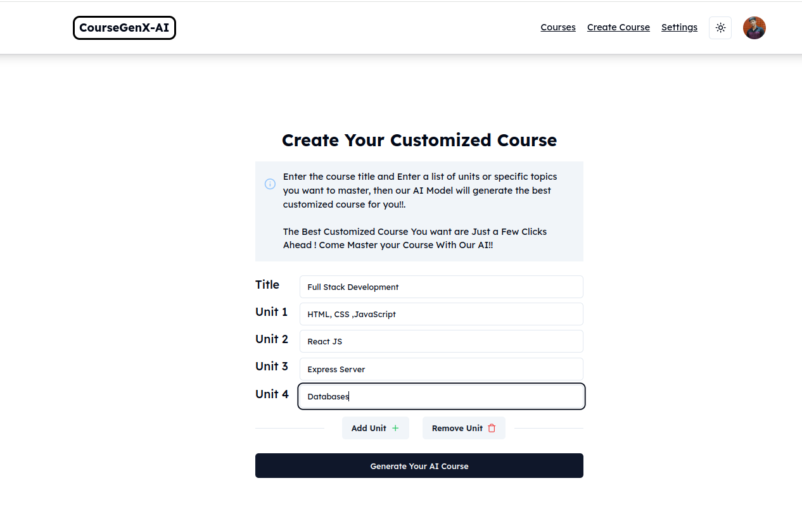
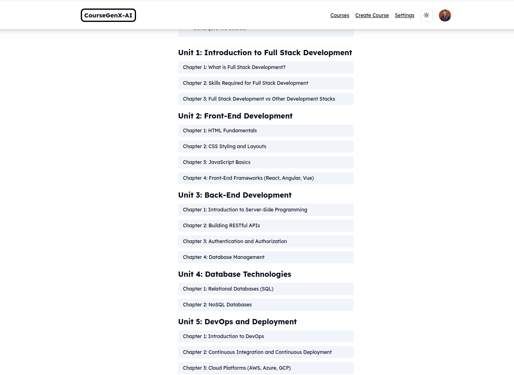
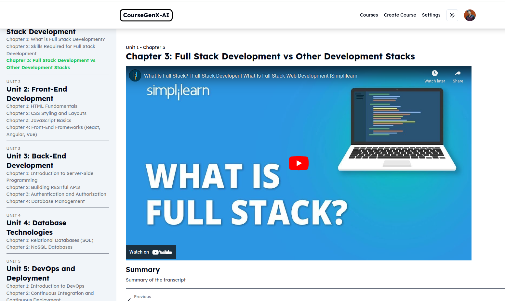

# CourseGenX-AI

Cannot Afford to Buy Courses or have no time in finding best Youtube Videos, Gotch You ,Come generate your Own course Using Our AI with your own customization added and get the best youtube videos and master any topic You want to.


### Features

- Authentication Using Next-Auth
- Create Your Own Course
- Subscription to Pro User
- Stripe Integration
- Light/dark mode toggle
- Get Best Youtube Videos
- Transcript and Summary of Each Video


### Tech Stack

- Next.js
- React.js
- Tailwind CSS
- Next-Auth
- TypeScript
- MySQL
- Prisma ORM
- Youtube API ,Open AI API ,Unsplash API 
- React Query


### Screenshots









### Seup Project Locally

Clone the project

```bash
  git clone https://github.com/neeraj-gs/CourseGen-AI.git
```

Go to the project directory

```bash
  cd coursegen-ai
```

Install dependencies

```bash
  npm install
```

Create a .env file and add the following secrets

```bash
  DATABSE_URL
  NEXT_AUTH_SECRET
  GOOGLE_CLIENT_ID
  GOOGLE_CLIENT_SECRET
  OPEN_AI_API_KEY
  UNSPLASH_API_KEY
  YOUTUBE_API_KEY
  STRIPE_API_KEY
  NEXT_AUTH_URL
  STRIPE_WEBHOOK_SECRET
```

Start the Server

```bash
  npm run dev
```
Project is Setup successfully.
### Deployment

Project is currently under build , Checkout Demo of project at:

```bash
  https://coursegen-x-ai.vercel.app/
```
This is the recorded video that is currently deployed , A fully-fledged app will soon be deployed
Need To Implement the stripe integration and fix the parallel calling of all api requests at once , and need to fix API limiting factor.
