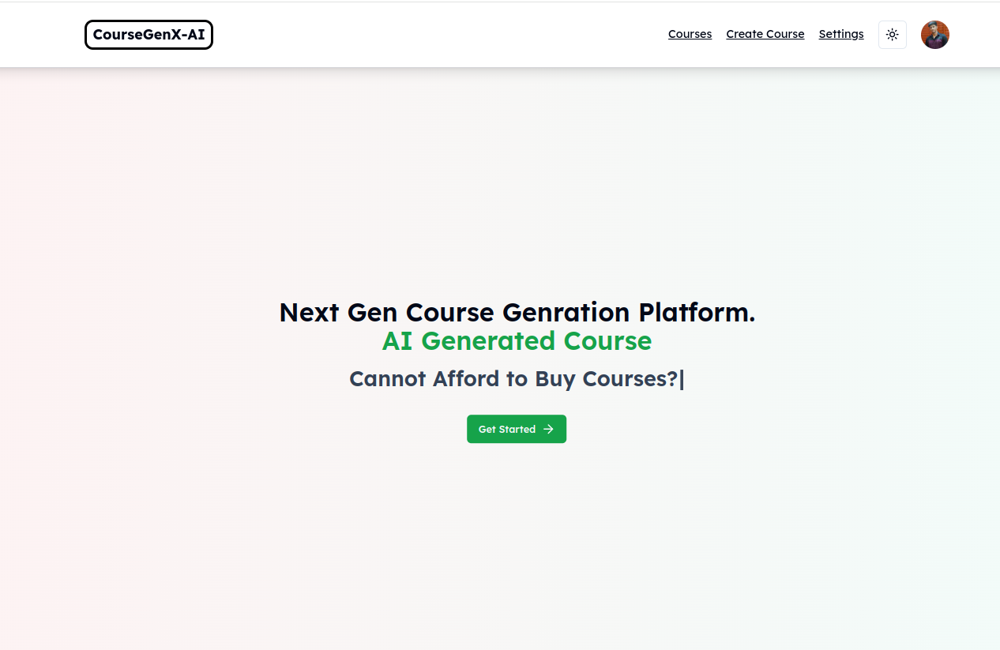
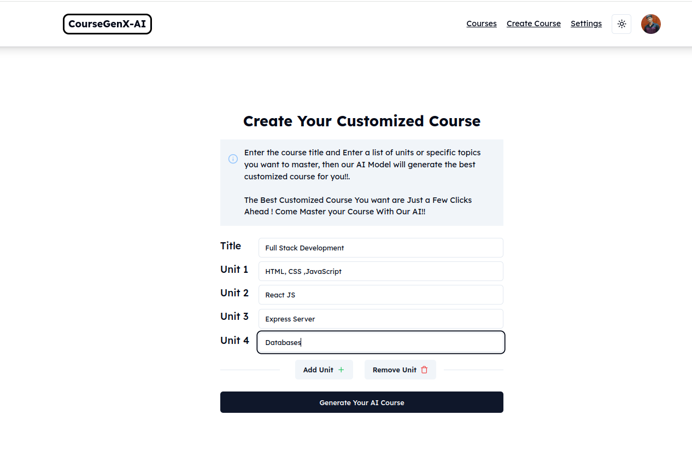
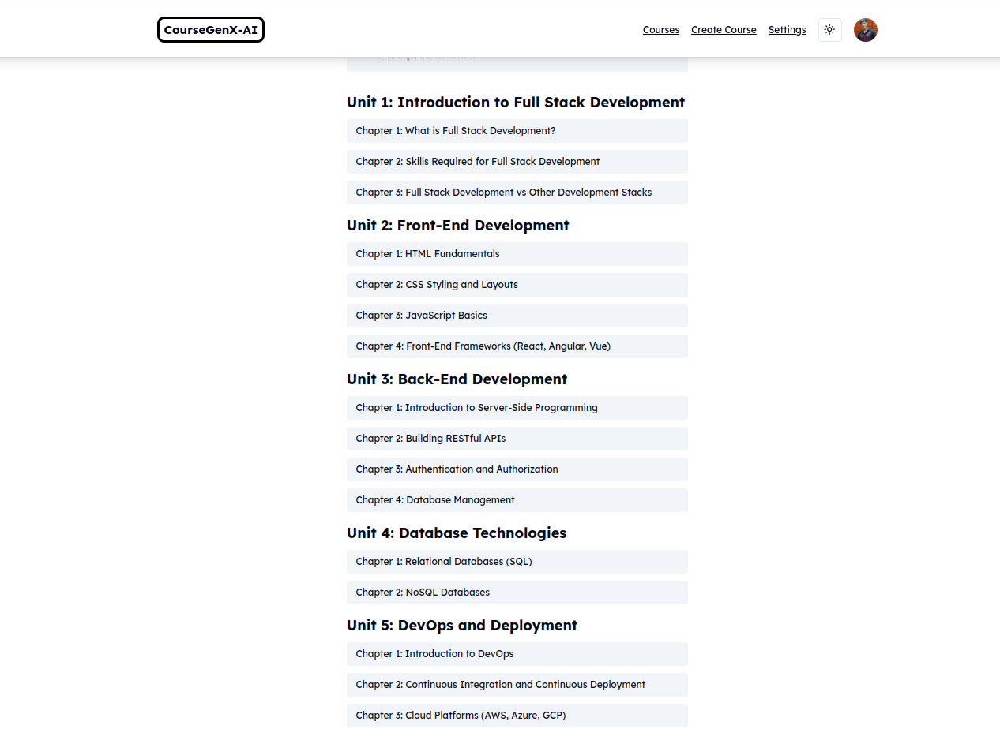
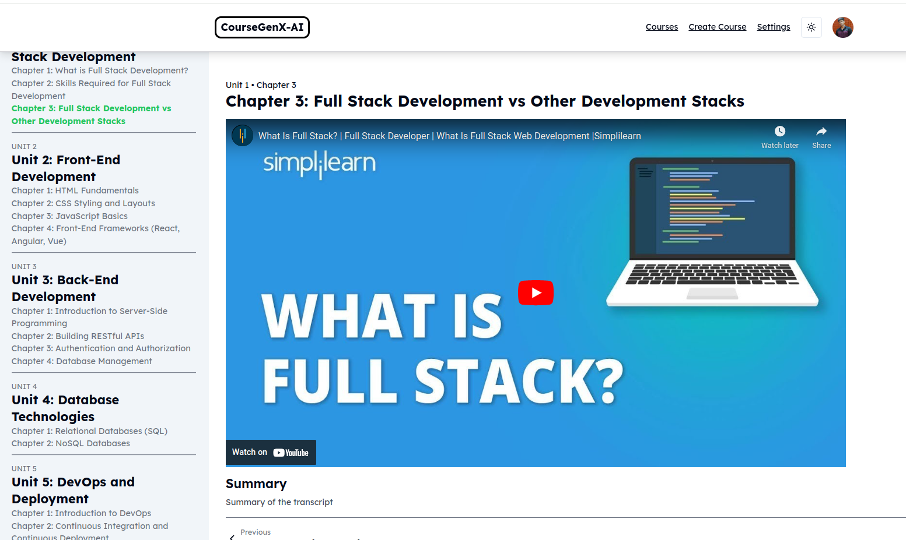

# CourseGenX-AI

Can't afford to buy courses, or don't have time to hunt for the best YouTube videos? Generate your own course with AI, customised to exactly the topics you want to master.

Give it a title and a list of units. The AI writes a syllabus — units broken into chapters — and for every chapter it finds a relevant YouTube lesson and writes a summary of it.

> **The deployed site is a demo.** The landing page embeds a full, unedited recording of the working app and needs **no environment variables at all** — it builds and deploys clean out of the box. Add the keys below to switch the interactive app on; until then every app screen shows a demo notice instead of an error.

## Features

- Google sign-in via NextAuth
- AI-generated course syllabus (units → chapters)
- A hand-picked YouTube video and AI summary per chapter
- Public course gallery
- Free credits per account, with an optional Stripe Pro subscription for unlimited generations
- Light/dark mode

## Tech Stack

Next.js 14 (App Router) · React · TypeScript · Tailwind CSS + shadcn/ui · NextAuth · Prisma + PostgreSQL · TanStack Query · OpenAI · YouTube Data API · Unsplash · Stripe

---

## Environment Variables

Copy `.env.example` to `.env` and fill it in.

**None of these are needed to deploy the landing page and demo video.** They are only required to run the interactive course generator.

### Required to run the app

| Variable | What it is | Where to get it |
|---|---|---|
| `DATABASE_URL` | PostgreSQL connection string | [Neon](https://neon.tech) (free), Supabase, Vercel Postgres, or Railway. Append `?sslmode=require` for hosted Postgres. |
| `NEXTAUTH_SECRET` | Signs session tokens | Generate: `openssl rand -base64 32` |
| `NEXTAUTH_URL` | Public origin, no trailing slash | `http://localhost:3000` locally; your deployed URL in production. Optional on Vercel (falls back to `VERCEL_URL`). |
| `GOOGLE_CLIENT_ID` | Google OAuth client | [Google Cloud Console → Credentials](https://console.cloud.google.com/apis/credentials) → OAuth client ID → Web application |
| `GOOGLE_CLIENT_SECRET` | Google OAuth secret | Same screen as above |
| `OPENAI_API_KEY` | Generates syllabus + summaries | [platform.openai.com/api-keys](https://platform.openai.com/api-keys) — the account needs billing credit |
| `YOUTUBE_API_KEY` | Finds a video per chapter | [Enable YouTube Data API v3](https://console.cloud.google.com/apis/library/youtube.googleapis.com), then create an API key |

### Optional

| Variable | Effect when unset |
|---|---|
| `OPENAI_MODEL` | Defaults to `gpt-4o-mini` |
| `UNSPLASH_API_KEY` | Course covers fall back to a bundled placeholder. Get the "Access Key" at [unsplash.com/oauth/applications](https://unsplash.com/oauth/applications) |
| `STRIPE_API_KEY` | Pro upgrade UI is hidden and `/api/stripe` returns 503 |
| `STRIPE_WEBHOOK_SECRET` | Same as above — both Stripe variables are needed to enable subscriptions |

> **Google OAuth redirect URI** must be `<NEXTAUTH_URL>/api/auth/callback/google`. Add both your localhost and production URLs.

> **YouTube quota:** each chapter costs 100 units against a default 10,000/day quota — roughly **100 chapters per day**. A 403 from the API almost always means the quota is spent.

---

## Run Locally

```bash
git clone https://github.com/neeraj-gs/CourseGen-AI.git
cd CourseGen-AI
npm install
cp .env.example .env      # then fill in the values
npm run db:push           # creates the tables in your database
npm run dev
```

Open http://localhost:3000. Check http://localhost:3000/api/health to confirm the database is reachable and no required variables are missing.

---

## Deploy to Vercel

### The demo site — no configuration

1. Push this repo to GitHub.
2. **New Project** in Vercel → import the repo.
3. Deploy. That's it — no environment variables required.

Leave **Root Directory** at the repo root — the Next.js app lives there.

`vercel.json` pins `"framework": "nextjs"` on purpose. A project imported while
the app still sat in a `coursegen-ai/` subdirectory gets its framework preset
saved as `null`, and that value is **not** re-detected when the app later moves.
A null preset builds the project as "Other": it runs `npm run build`, ignores
`.next/`, and publishes `public/` as a static folder — so `/Course.mp4` serves
fine while `/` and every route return `404: NOT_FOUND`, with a completely
green build log. Pinning it in `vercel.json` overrides the stored setting and
makes the repo self-describing.

The landing page is statically prerendered, and the demo video only downloads when a visitor presses play.

### Switching the full app on

5. Add every variable from the required table above.
6. Set `NEXTAUTH_URL` to the real deployment URL and add `<url>/api/auth/callback/google` to your Google OAuth client, then redeploy.
7. Create the tables against your production database:
   ```bash
   DATABASE_URL="<your production url>" npx prisma db push
   ```
8. Visit `/api/health` on the deployed URL — it should return `{"status":"ok"}`.

Stripe (optional): add a webhook endpoint at `<your-url>/api/webhook` for the events `checkout.session.completed`, `invoice.payment_succeeded`, `customer.subscription.updated`, `customer.subscription.deleted`, then set `STRIPE_WEBHOOK_SECRET`.

### Function timeouts

Course generation calls OpenAI several times, so `/api/course/createChapters` and `/api/chapter/getInfo` declare `maxDuration = 60`. That is the ceiling on Vercel's Hobby plan; Pro allows up to 300s. Keeping courses to 3–8 units comfortably fits inside 60s.

---

## Deploy with Docker

```bash
docker build -t coursegen-ai .
docker run -p 3000:3000 --env-file .env coursegen-ai
```

The Dockerfile builds with `output: 'standalone'` (enabled by `DOCKER_BUILD=1`) and runs as a non-root user.

---

## Screenshots









---

## Coming Soon

- AI quiz at the end of each lesson
- AI-generated Q&A for reference
- Advanced lessons for specific sub-sections
